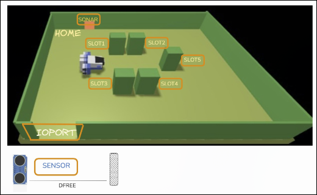

# Requisiti TF2026

Una compagnia di trasporto marittimo cargo (d'ora in poi, semplicemente *compagnia*) intende automatizzare le operazioni di carico dei container nella stiva della nave (o semplicemente *stiva*). A questo scopo, la compagnia prevede di impiegare un robot a guida differenziale (d'ora in poi chiamato *cargorobot*).

La stiva e' un'area rettangolare e piana con una porta di Input/Output (*IOPort*). L'area fornisce 4 slot per conservare i container e uno slot chiamato `slot5`.

Nell'immagine sopra:

- Gli `slot1-4` rappresentano le aree della stiva riservate alla conservazione di un container ciascuna.
- Lo `slot5` rappresenta un'area in cui il *cargorobot* deve conservare temporaneamente un container prima di collocarlo in uno degli `slot1-4`. Durante la conservazione temporanea, un dispositivo *marker* etichetta il container con un codice a barre identificativo e segnala quando questa attivita' di marcatura e' completata.
- L'`IOPort` e' un dispositivo con un pulsante e un display. Il pulsante viene premuto dal cliente per inviare una richiesta di carico di un container sulla nave cargo. Il display viene usato per mostrare la risposta alla richiesta e per mostrare lo stato corrente della stiva.
- Il sensore associato all'`IOPort` e' un dispositivo (un sonar) usato per rilevare la presenza di un container quando misura una distanza `D` tale che `D < DFREE/2` per un tempo ragionevole, ad esempio 3 secondi.

## Requisiti TF2026

La compagnia ci chiede di costruire un servizio chiamato `cargoservice`, che deve funzionare come segue.

Il `cargoservice` e' in grado di ricevere una richiesta di carico di un container inviata da un cliente usando il pulsante dell'`IOPort`.

- Invia la risposta `retrylater` se l'`IOPort` e' attualmente occupato da un container oppure se il sistema e' fuori servizio.
- Rifiuta la richiesta quando la stiva e' gia' piena, cioe' quando gli `slot1-4` sono gia' occupati.
- Altrimenti, considera il sistema come impegnato, rileva uno slot libero e restituisce come risposta il nome dello slot riservato. Mentre e' impegnato, il sistema deve far lampeggiare un Led.

Quando la richiesta di carico viene accettata, il cliente deve spostare il container nell'area del sensore entro una quantita' di tempo prefissata, ad esempio 30 secondi; altrimenti, il sistema torna nello stato non impegnato. Poi il `cargoservice` usa il `cargorobot` per spostare il container dall'`IOPort` allo `slot5`, per la marcatura del container, e poi allo slot riservato.

Il servizio deve anche mostrare sul display dell'`IOPort`:

- lo stato corrente della stiva;
- il messaggio `Service working`, quando tutto procede correttamente;
- il messaggio `Out of service` se il sensore sonar misura una distanza `D > DFREE` per almeno 3 secondi, forse a causa di un guasto del sonar.
